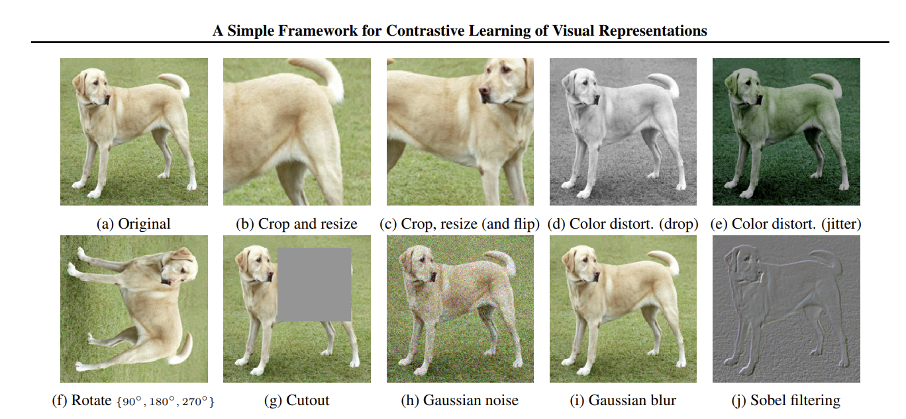
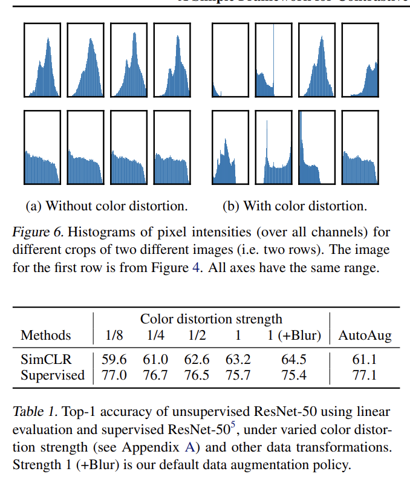

"A Simple Framework for Contrastive Learning of Visual Representations" by Ting Chen et al. :

Problem:
The authors aim to develop a simple framework for contrastive learning of visual representations in deep neural networks.

---

Key Related Works:
The paper builds upon existing research in deep learning, representation learning, and computer vision.

---

Solutions:
The authors proposed a simple framework for contrastive learning that leverages the similarity between different image transformations to learn better visual representations. The framework consists of a data augmentation step to generate transformed images, a contrastive loss function that encourages similar representations for transformed images, and an encoder network that maps images to feature vectors.

---

Results:
Experiments on benchmark datasets showed that the proposed framework outperformed existing approaches in terms of representation quality and transfer performance. The results demonstrated the effectiveness of the contrastive learning approach in learning better visual representations, and the simplicity and scalability of the proposed framework.

---
