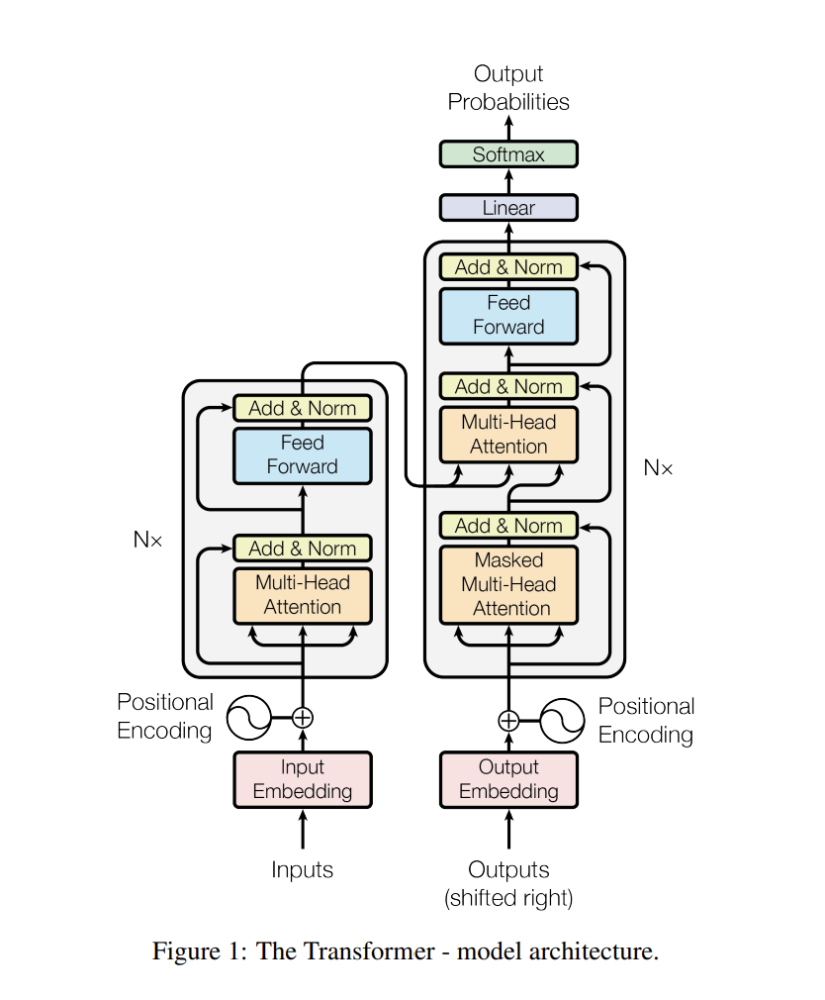
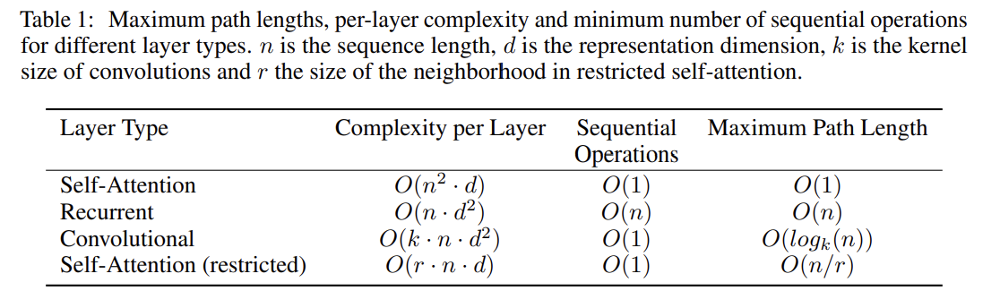
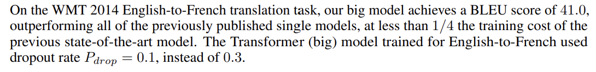

Attention Is All You Need" by Vaswani et al. :

Problem:
The authors aim to propose a new neural network architecture for sequence modeling tasks that does not rely on recurrent or convolutional layers.

---

Key Related Works:
The paper builds upon existing research in deep learning, sequence modeling, and machine translation.

---

Solutions:
The authors proposed a new neural network architecture, called the Transformer, that utilizes self-attention mechanisms to learn contextual relationships between different elements of a sequence. The Transformer consists of a self-attention module and a feedforward network, and can be trained end-to-end using standard backpropagation techniques.

---

Results:
Experiments on benchmark datasets for machine translation and language modeling showed that the Transformer outperformed existing approaches in terms of quality and speed. The results demonstrated the effectiveness of the self-attention mechanism in modeling long-range dependencies in sequences and the potential of the Transformer architecture for various sequence modeling tasks.

---
