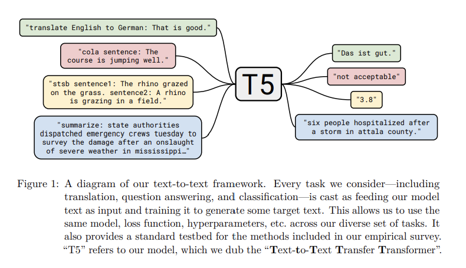

The paper "Exploring the Limits of Transfer Learning with a Unified Text-to-Text Transformer" explores the potential of transfer learning using a unified text-to-text transformer (T5) model. The authors aim to improve the performance of natural language processing (NLP) tasks by pretraining the T5 model on a diverse set of tasks and then fine-tuning it for specific tasks.

Problems:
The authors note that previous NLP models suffered from the problem of catastrophic forgetting, where the model's previous knowledge is lost when it is fine-tuned for a new task. This limits the model's ability to transfer knowledge across different tasks.

Key Related Works:
The authors build upon previous work in NLP, including the use of transfer learning and pretraining, as well as the use of transformer models like BERT and GPT. They also draw upon work in machine translation and summarization.

---

Solutions:
The authors propose using a unified text-to-text transformer model (T5) that is pre-trained on a diverse set of tasks, including question answering, summarization, and machine translation. They fine-tune the T5 model on specific tasks by providing task-specific prompts, which allows the model to transfer knowledge across different tasks without catastrophic forgetting.

The importance of pre-training models for natural language processing (NLP) tasks as listed above and below and the use of unsupervised learning on unlabeled data for pre-training is discussed. The abundance of unlabeled text data available on the internet makes it an attractive option for NLP tasks. The article introduces a unified approach to transfer learning that treats every text processing problem as a "text-to-text" problem, which allows for systematic study of different approaches and understanding of existing methods for transfer learning.

The Model 

This paper describes the Transformer architecture, which has become a popular model for natural language processing tasks. The Transformer architecture is based on self-attention, which is a variant of attention that processes a sequence by replacing each element with a weighted average of the rest of the sequence. The original Transformer was an encoder-decoder architecture designed for sequence-to-sequence tasks, but it has also been used in other contexts, such as language modeling or classification and span prediction tasks. The encoder and decoder each consist of a stack of blocks, each of which contains a self-attention layer followed by a small feed-forward network. Layer normalization is applied to the input of each subcomponent, and a residual skip connection adds each subcomponent's input to its output. Dropout is applied within the feed-forward network, on the skip connection, on the attention weights, and at the input and output of the entire stack. The decoder includes a standard attention mechanism after each self-attention layer that attends to the output of the encoder. The self-attention mechanism in the decoder also uses a form of autoregressive or causal self-attention, which only allows the model to attend to past outputs. The output of the final decoder block is fed into a dense layer with a softmax output, whose weights are shared with the input embedding matrix. All attention mechanisms in the Transformer are split up into independent "heads" whose outputs are concatenated before being further processed. Finally, the Transformer typically uses position embeddings to provide an explicit position signal. The passage also notes that the authors of the paper being discussed make some simplifications to the original Transformer architecture, such as removing the Layer Norm bias and using a different position embedding scheme, but these changes are not significant for the purposes of the experiments being conducted.

---

The Thing about Unsupervised Learning 

The paper discusses the importance of an unsupervised objective in pre-training models with unlabeled data for NLP problems using transfer learning. While previous work used a causal language modeling objective, denoising objectives, also known as masked language modeling, have shown better performance and have become standard. In a denoising objective, the model is trained to predict missing or corrupted tokens in the input by randomly dropping out 15% of tokens and replacing consecutive spans of dropped-out tokens with a single sentinel token that is unique over the example. The target corresponds to all the dropped-out spans of tokens, delimited by the same sentinel tokens used in the input sequence plus a final sentinel token to mark the end of the target sequence. This objective reduces the computational cost of pre-training and is compared to other variants in Section 3.3.

Results:
The authors report that the T5 model outperforms previous state-of-the-art models on a range of NLP tasks, including question answering, summarization, and machine translation. They also show that the T5 model can perform well on tasks that it was not explicitly trained on, demonstrating the model's ability to transfer knowledge across tasks. Finally, the authors report that the T5 model can be trained efficiently and at scale, making it a practical tool for NLP research and applications.

