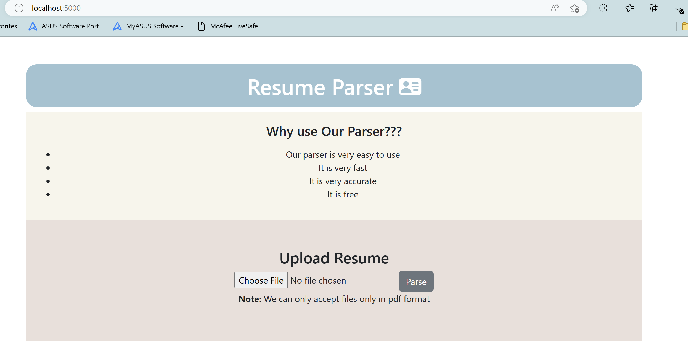
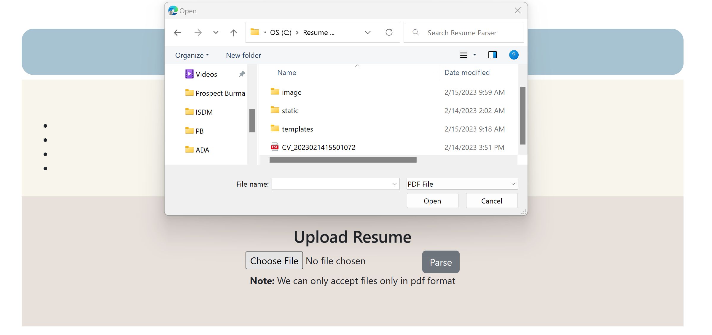
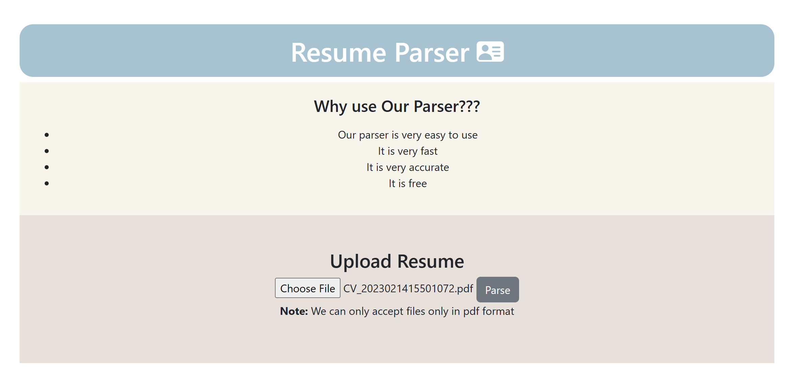

# Resume Parser

## How to run

- pip install -r requirements.txt
- python3 app.py  `  `
  Running inside vitual environment (https://github.com/jakerieger/FlaskIntroduction)
- pip install virtualenv
- virtualenv env
- source env/bin/activate
- pip install -r requirements.txt
- python app.py
  Note: according to flash tutorial on youtube wiht link listed down below in Refrence

## Project Description

We use Flash to create a resume parser which allows us to parses skill and education written in the resume and identify them correctly. everything relies on the file 'resume_parser.py'

## How I work on this project

Our main job is to extract desired credentials , simply spaCy to the rescue. a pipeline 'entity ruler' was added  i.e. it will help us with entity recognition from the defined token-based rules ( with function we created to token the input resume using pdfreader) or exact phrases will match if everything goes as planned.

## Reference

Flask tutorial

- https://www.youtube.com/watch?v=Z1RJmh_OqeA&t=1670s

# Demo of the Running Application

